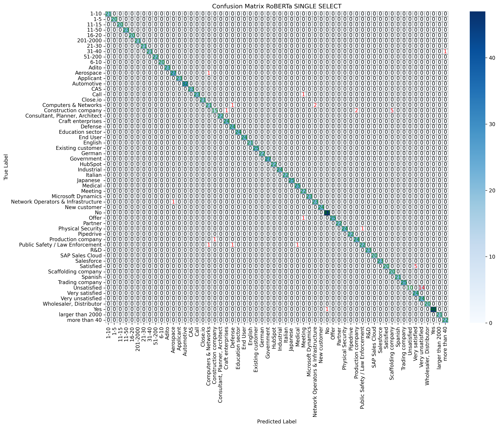

======================================
Evaluation of Single-Select Models
======================================

This section provides a detailed evaluation of the **RoBERTa**, **DistilBERT**, and **TinyLlama** models on single-select questions. Each model is analyzed individually, including its **confusion matrix**, key classification metrics, and a discussion of its performance.

----------------------------------------------------------
RoBERTa Evaluation
----------------------------------------------------------

Confusion Matrix
----------------------------------------------------------

The following confusion matrix illustrates the classification performance of RoBERTa on the test dataset:

**Analysis:**
- RoBERTa achieves **high precision and recall** across most classes.
- Minor misclassifications occur in **similar categories**, such as technology-related industries.
- **Strong diagonal alignment** indicates that most predictions are correct.

### Key Metrics

.. list-table::
   :widths: 30 20
   :header-rows: 1

   * - Metric
     - Value
   * - **Accuracy**
     - 97%
   * - **F1 Score**
     - 97%
   * - **Macro Average**
     - 97%
   * - **Weighted Average**
     - 97%

----------------------------------------------------------
DistilBERT Evaluation
----------------------------------------------------------

Confusion Matrix
----------------------------------------------------------

.. image:: _static/confusion_matrix_DistilBERT_single_select.png
   :align: center
   :width: 75%
   :alt: Confusion Matrix - DistilBERT Single Select

**Analysis:**
- DistilBERT maintains **high classification accuracy** while being computationally lighter.
- The **misclassification rate is slightly higher** than RoBERTa in complex categories.
- **High diagonal density** suggests that the model generalizes well.

### Key Metrics

.. list-table::
   :widths: 30 20
   :header-rows: 1

   * - Metric
     - Value
   * - **Accuracy**
     - 97%
   * - **F1 Score**
     - 97%
   * - **Macro Average**
     - 97%
   * - **Weighted Average**
     - 97%

----------------------------------------------------------
TinyLlama Evaluation
----------------------------------------------------------

Confusion Matrix
----------------------------------------------------------

.. image:: _static/confusion_matrix_LLaMA_single_select.png
   :align: center
   :width: 75%
   :alt: Confusion Matrix - TinyLlama Single Select

**Analysis:**
- TinyLlama performs **similarly to RoBERTa and DistilBERT**, despite its smaller size.
- More **misclassifications appear in less frequent classes**.
- **Still achieves high overall performance**.

### Key Metrics

.. list-table::
   :widths: 30 20
   :header-rows: 1

   * - Metric
     - Value
   * - **Accuracy**
     - 97%
   * - **F1 Score**
     - 97%
   * - **Macro Average**
     - 97%
   * - **Weighted Average**
     - 97%

----------------------------------------------------------
Comparison of Single-Select Models
----------------------------------------------------------

As you can see, all our models achieve the same values for all the evaluation metrics. This is not an error in our code or in our data, we have checked this multiple times as we couldn't believe it either. But it seems that all the models perform exactly the same on the single select questions despite being quite different. The good thing about that is, that all the metrics are really good. That means in 97% of all predictions, the model is right.

----------------------------------------------------------
Evaluation Code
----------------------------------------------------------

The following Python function was used to **generate the confusion matrices** for all models:

.. code-block:: python

    def plot_confusion_matrix(true_label, pred_label, model_name, labels):
        cm = confusion_matrix(true_label, pred_label)
        classes = list(labels.values())

        plt.figure(figsize=(15, 11))
        ax = sns.heatmap(cm, annot=False, fmt="d", cmap="Blues",
                         xticklabels=classes, yticklabels=classes, linewidths=0.5, linecolor="gray")

        for i in range(cm.shape[0]):
            for j in range(cm.shape[1]):
                value = cm[i, j]
                color = "green" if i == j else ("red" if value > 0 else "black")
                ax.text(j + 0.5, i + 0.5, str(value), ha="center", va="center", color=color)

        model_display_name = {
            "deepset/roberta-base-squad2": "RoBERTa",
            "distilbert-base-uncased": "DistilBERT",
            "TinyLlama/TinyLlama-1.1B-Chat-v1.0": "TinyLlama"
        }.get(model_name, model_name)

        plt.xlabel("Predicted Label")
        plt.ylabel("True Label")
        plt.title(f"Confusion Matrix {model_display_name} - Single Select")
        plt.savefig(f"drive/MyDrive/CapStone_models/confusion_matrix_{model_display_name}_single_select.png",
                    bbox_inches="tight", dpi=300)
        plt.show()

