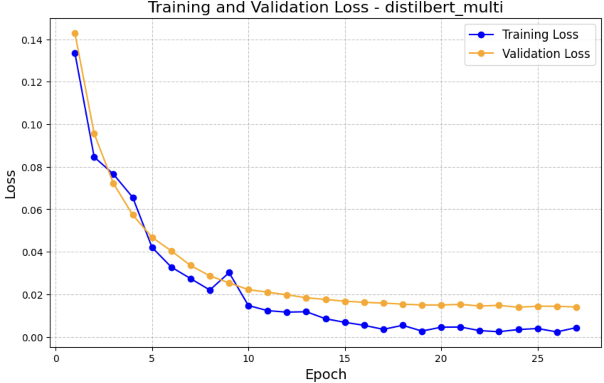
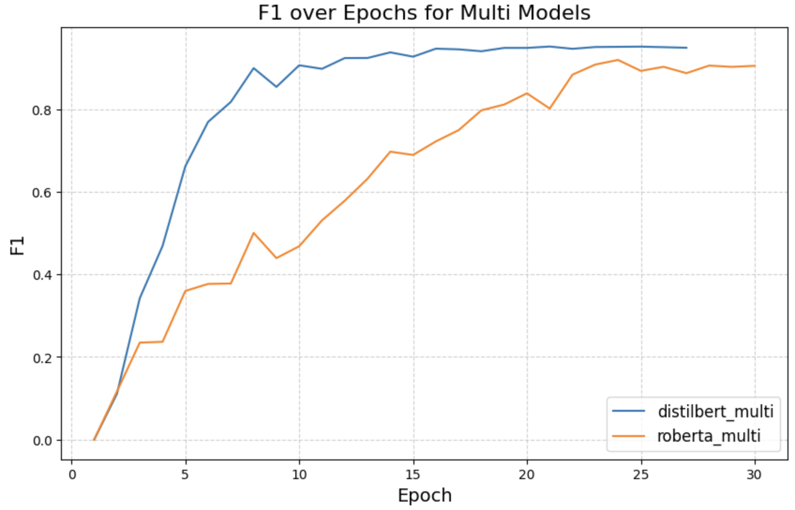
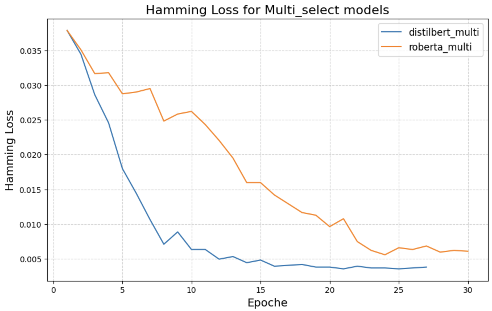
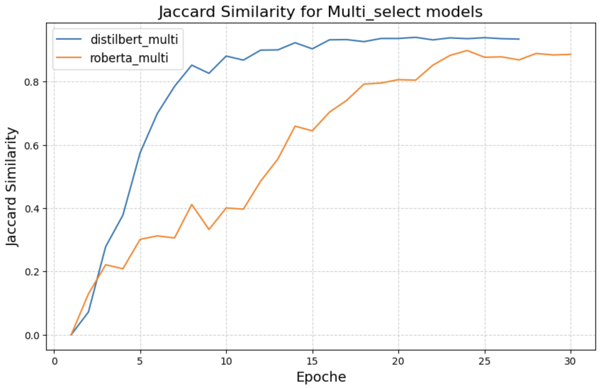
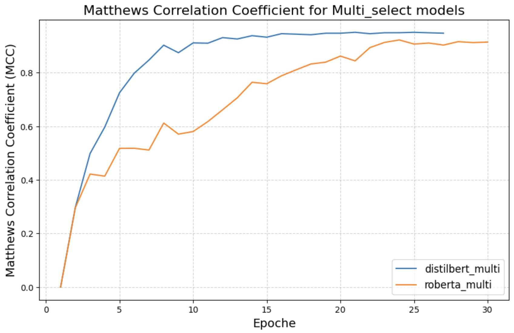
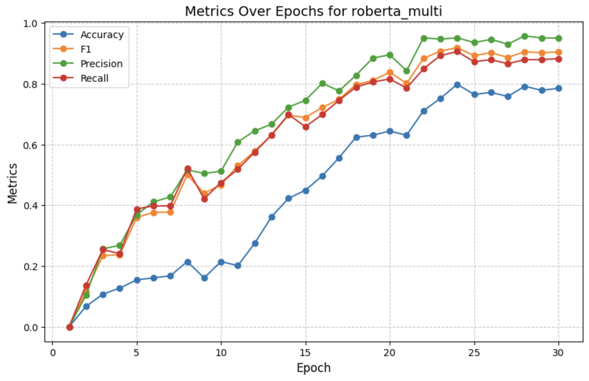
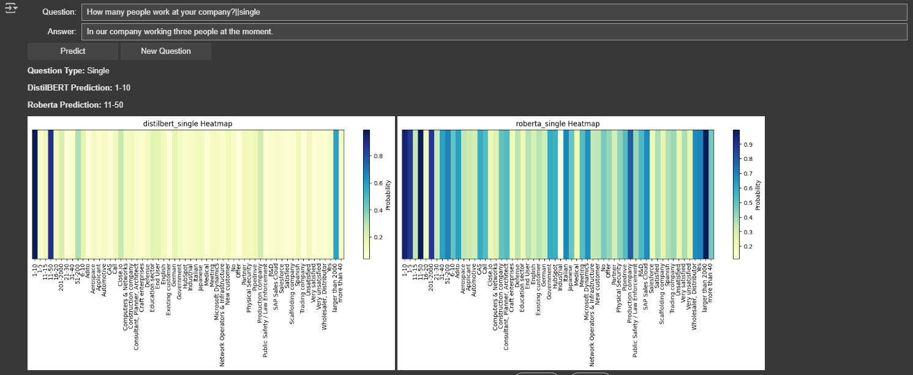
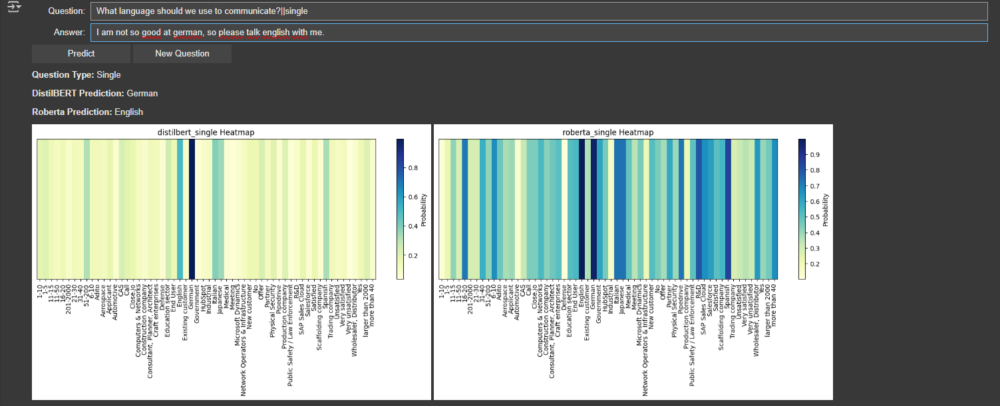

========================
Evaluation of Multi-Select Models
========================

This page presents the evaluation of the **DistilBERT** and **RoBERTa** models for multi-select classification. These models have been trained to predict multiple labels for each input and are assessed using various performance metrics.

Introduction
============
The multi-select models are designed to assign one or multiple labels to each input. Their performance is evaluated using the following key metrics:

- **F1 Score**: A balance between precision and recall.
- **Hamming Loss**: Measures the proportion of incorrect labels in multi-label classification.
- **Jaccard Similarity**: Assesses the similarity between predicted and actual labels.
- **Matthews Correlation Coefficient (MCC)**: Evaluates the overall classification quality.

Training and Validation Loss
============================
The following graph illustrates the training and validation loss for the **DistilBERT Multi-Select Model**:

The validation loss stabilizes after a few epochs, indicating that the model is learning effectively without overfitting.

F1 Score Over Epochs
=====================
The graph below shows the progression of the F1 score for **DistilBERT** and **RoBERTa** over training epochs:

**DistilBERT** achieves high scores faster than **RoBERTa**, though both models improve steadily throughout training.

Hamming Loss for Multi-Select Models
====================================
Hamming loss represents the proportion of incorrect labels assigned by the model:

Lower values indicate better performance. **DistilBERT** has a lower Hamming loss than **RoBERTa**, meaning it makes fewer incorrect predictions.

Jaccard Similarity for Multi-Select Models
==========================================
Jaccard similarity measures how closely the predicted labels match the true labels:

Again, **DistilBERT** outperforms **RoBERTa**, demonstrating better alignment with the actual labels.

Matthews Correlation Coefficient (MCC)
======================================
MCC assesses the model's ability to distinguish between classes effectively:

Higher MCC values indicate better classification performance, with **DistilBERT** outperforming **RoBERTa**.

Metrics Over Epochs for RoBERTa
===============================
The following graph illustrates how accuracy, precision, recall, and F1 score evolve over time for the **RoBERTa Multi-Select Model**:

The consistent improvement across these metrics indicates effective model optimization.

Interactive Evaluation Dashboard
================================
A **dashboard** was created to visualize individual model predictions:

At first it generates a random question out of the provided datasets and determine if its a single or multi select question. After that, the user can input his answer manually. By clicking 'predict' it uses the trained models from 'DistilBERT' and 'RoBERTa' to predict the labels of the answer text. Based on the outputs, a heatmap gets automatically generated for each model and shows the probabilities for every potential label from the dataset. We used this approach to gain more insights on the models decison making process.

The first example shows the question 'How many people work at your company?', which is a single select question, with the following answer 'In our company working three people at the moment.'. For that answer DistilBERT predicted the label '1-10', which is right, and RoBERTa predicted '11-50' in that case the wrong answer. The following heatmap for DistilBERT shows, that the model mainly ranged between two labels, but the right one got the better score. Meanwhile RoBERTa had some more issues, since the heatmap shows that several more labels were on the short list and the wrong label got chosen in the end. Based on this example you can see the difficulties from models to translate numerical values in letter values.

The second example shows the question 'What language should we use to communicate?', which is a single select question, with the following answer: 'I am not so good at german, so please talk english with me.'. For that answer DistilBERT predicted the label 'German', which is wrong, while RoBERTa predicted with 'English', the right label. Here you can also see clearly on the heatmap, that RoBERTa had several labels in the closer selection, but predicted right in the end. While DistilBERT probably made the mistake, to use the 'good at' in front of 'german' as the prediction and overlooked the connection to 'not so' in front of that. Based on that it becomes clear how impotantz it is for the model to recognize the complete connection and meaning in a sentence.

Classification Reports
======================
Below are the **final classification reports** for the multi-select models.

**DistilBERT Multi-Select Report**:

.. code-block:: text

    Epoch  | Training Loss | Validation Loss | Accuracy | F1 Score | Precision | Recall | Hamming Loss | Jaccard Similarity | MCC
    -----------------------------------------------------------------------------------------------
    1      | 0.1336        | 0.142971        | 0.000000 | 0.000000 | 0.000000  | 0.000000 | 0.037862     | 0.000000           | 0.000000
    5      | 0.0421        | 0.046828        | 0.395973 | 0.661642 | 0.787505  | 0.622074 | 0.017982     | 0.575056           | 0.725100
    10     | 0.0147        | 0.022184        | 0.758389 | 0.906225 | 0.948690  | 0.889632 | 0.006332     | 0.880984           | 0.911176
    30     | 0.0163        | 0.024724        | 0.785235 | 0.904898 | 0.950920  | 0.882943 | 0.006078     | 0.886130           | 0.914236

**RoBERTa Multi-Select Report**:

.. code-block:: text

    Epoch  | Training Loss | Validation Loss | Accuracy | F1 Score | Precision | Recall | Hamming Loss | Jaccard Similarity | MCC
    -----------------------------------------------------------------------------------------------
    1      | 0.1392        | 0.146601        | 0.000000 | 0.000000 | 0.000000  | 0.000000 | 0.037862     | 0.000000           | 0.000000
    10     | 0.0517        | 0.057982        | 0.214765 | 0.468044 | 0.512239  | 0.474916 | 0.026212     | 0.400671           | 0.580371
    30     | 0.0163        | 0.024724        | 0.785235 | 0.904898 | 0.950920  | 0.882943 | 0.006078     | 0.886130           | 0.914236

Conclusion
==========

The evaluation of DistilBERT and RoBERTa for multi-select classification reveals differences in their performance across key metrics. **DistilBERT consistently outperforms RoBERTa** in terms of F1 score, Jaccard similarity, Matthews Correlation Coefficient (MCC), and Hamming loss. This indicates that DistilBERT not only achieves higher classification accuracy but also makes **fewer incorrect predictions** in multi-label settings. Although RoBERTa shows continuous improvement over epochs, its overall classification performance remains slightly lower. However, its ability to generalize well over time is evident in the stability of the evaluation metrics towards the later epochs.

In conclusion, DistilBERT seems to be the better choice for this task, especially when high precision and recall are required.
