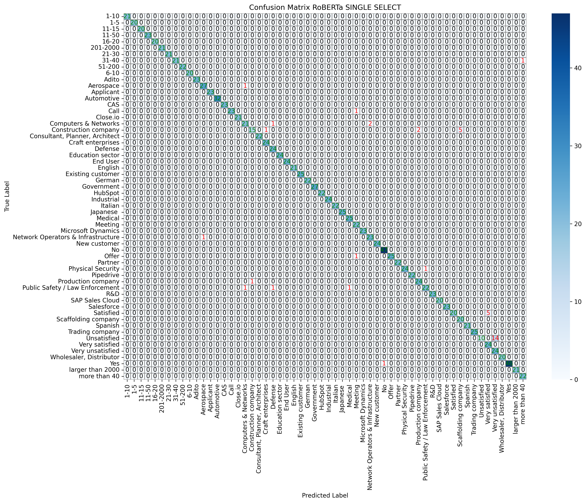

======================================
Evaluation of Single-Select Models
======================================

This section provides an evaluation of the **RoBERTa**, **DistilBERT**, and **TinyLlama** models on single-select questions.

----------------------------------------------------------
RoBERTa Evaluation
----------------------------------------------------------

**Confusion Matrix**

The following confusion matrix illustrates the classification performance of RoBERTa on the test dataset:

**Analysis:**
RoBERTa achieves **high precision and recall** across most classes. Minor misclassifications occur in **similar categories**, such as 'unsatisfied' and 'very unsatisfied'. Even for humans the difference between those two labels may be hard to distinguish. Overall the matrix shows a **strong diagonal alignment**, which indicates that most predictions are correct.

**Key Metrics**

.. list-table::
   :widths: 30 20
   :header-rows: 1

   * - Metric
     - Value
   * - **Accuracy**
     - 96.1%
   * - **F1 Score**
     - 95.5%
   * - **Precision**
     - 95.4%
   * - **Recall**
     - 96.1%

----------------------------------------------------------
DistilBERT Evaluation
----------------------------------------------------------

**Confusion Matrix**

**Analysis:**
DistilBERT maintains **high classification accuracy** while being computationally lighter. The missclassifications and the overall looks are very similar to RoBERTas. The **High diagonal density** suggests that the model performs good.

**Key Metrics**

.. list-table::
   :widths: 30 20
   :header-rows: 1

   * - Metric
     - Value
   * - **Accuracy**
     - 96.6%
   * - **F1 Score**
     - 96.9%
   * - **Precision**
     - 97.4%
   * - **Recall**
     - 96.9%

----------------------------------------------------------
TinyLlama Evaluation
----------------------------------------------------------

**Confusion Matrix**

.. image:: _static/confusion_matrix_LLaMA_single_select.png
   :align: center
   :width: 75%
   :alt: Confusion Matrix - TinyLlama Single Select

**Analysis:**
TinyLlama performs **similarly to RoBERTa and DistilBERT**, despite its smaller size, it **still achieves high overall performance**.

**Key Metrics**

.. list-table::
   :widths: 30 20
   :header-rows: 1

   * - Metric
     - Value
   * - **Accuracy**
     - 98.5%
   * - **F1 Score**
     - 98.5%
   * - **Precision**
     - 98.6%
   * - **Recall**
     - 98.5%

----------------------------------------------------------
Further Analysis
----------------------------------------------------------

As you can see, all our models achieve similar values for all evaluation metrics. This is very positive, since all the values are really good for text classification tasks. It means that in approximatly 97% of all predictions, the models are right.

If you want to dive into the training process, you can take a look at the behavior of the loss values for both training and validation loss.

.. image:: _static/single_loss.png
   :align: center
   :width: 75%
   :alt: Loss Development Over The Training Process - RoBERTa Single Select

You may recognize, that both training and validation loss are decreasing with ongoing training progress. That means that we dont have major problems with **overfitting**.

The opposite should be the behavior of the **accuracy**. It schould increase with progressing training. To evaluate this, we can look at this curve as well.

As expected, the accuracy increases over time. But you can see as well, that the starting accuracy in the first epoch is quite high already. That means that the model is pretrained really good.

----------------------------------------------------------
Evaluation Code
----------------------------------------------------------

The following Python function was used to **generate the confusion matrices** for all models:

.. code-block:: python

    def plot_confusion_matrix(true_label, pred_label, model_name, labels):
        cm = confusion_matrix(true_label, pred_label)
        classes = list(labels.values())

        plt.figure(figsize=(15, 11))
        ax = sns.heatmap(cm, annot=False, fmt="d", cmap="Blues",
                         xticklabels=classes, yticklabels=classes, linewidths=0.5, linecolor="gray")

        for i in range(cm.shape[0]):
            for j in range(cm.shape[1]):
                value = cm[i, j]
                color = "green" if i == j else ("red" if value > 0 else "black")
                ax.text(j + 0.5, i + 0.5, str(value), ha="center", va="center", color=color)

        model_display_name = {
            "deepset/roberta-base-squad2": "RoBERTa",
            "distilbert-base-uncased": "DistilBERT",
            "TinyLlama/TinyLlama-1.1B-Chat-v1.0": "TinyLlama"
        }.get(model_name, model_name)

        plt.xlabel("Predicted Label")
        plt.ylabel("True Label")
        plt.title(f"Confusion Matrix {model_display_name} - Single Select")
        plt.savefig(f"drive/MyDrive/CapStone_models/confusion_matrix_{model_display_name}_single_select.png",
                    bbox_inches="tight", dpi=300)
        plt.show()

